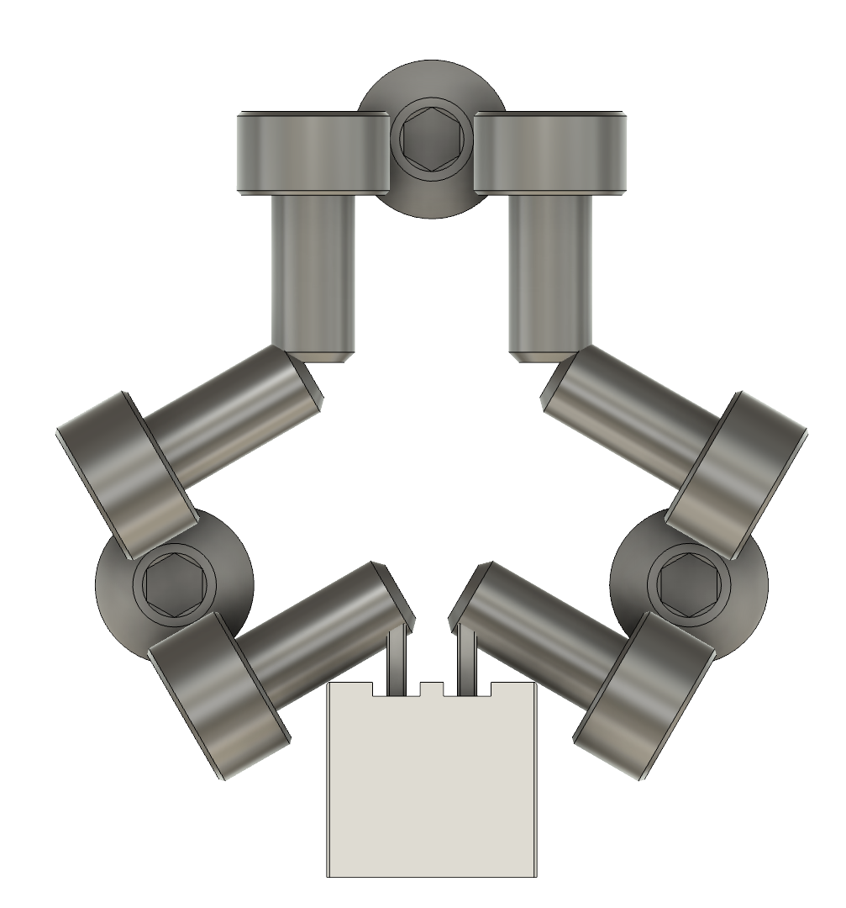

# Design

**What’s interesting here?**

There's a lot of design complexity in a tiny space.  This is a 100% functionality-optimized design.

The key is the electrical layout.

In Nudge, M3 socket-head screws serve triple-duty as (1) NC (normally-closed) electrical contacts, (2) Maxwell-type kinematic couplings, and (3) contacts for the external (JST) connection.  Let's unpack that.

**Electrical Contacts**: the cylindrical surface of the socket-head screws interacts smoothly with M3 button-head screws and forms a good electrical contact when pushed together with enough force.  Basic N35 6mm magnets work well here; in tests, this setup proved more repeatable than springs, without requiring any force tuning.  You can still tune the attraction between the mount and the wobbler, by unscrewing the wobbler screws evenly.  Stronger magnets required too much probe force, which measurably stretched the belts during long repeatability tests.

The screw tips press into each other, closing electrical contacts; this choice eliminated the need for more parts.  Originally, the screws faced out and used carefully bent solid wires or ring/spade terminals with flexible wire.  Screws facing in is much better.   Thanks `caza` for that suggestion!

Putting both parts of the SHCS to work required designing around specific screw lengths, and getting it all to work with tiny M3x6 screws was a challenge.

**Maxwell-type Kinematic Coupling**: A Maxwell coupling is a type of kinematic (repeatable) coupling that is symmetric.  The whole setup is similar to a Renishaw-style touch probe for CNC.

**Contacts for external JST connections**: the screw cuts a thread against the square JST terminals to close the connection.  The design evolved from ring terminals clamped by the screws (extra parts to source), to direct wire clamps, to a vertically-pointed straight JST, to a right-angle JST, to finally, a front-facing straight-through JST.  If people have issues with the cut screws, we can always revert to right-angle terminals.

**Design for Printability**:
A lot of thought/work went into designing this for clean 3D printing:
* overhangs beyond 45 degrees are avoided: teardrops around the rear-most two screw holes are an example
* careful multi-stage bridging near the JST connector
* the STls are oriented with seams at back

**Design for Assembly**:
* The shrouds around the SHCS guide screw in; without these features, the SHCS can go in slightly crooked.
* Magnet removal holes help when you have bajillions of prototypes
* Magnet holes are aligned to perimeters to enable press-fit magnets
* All formed threads have small counterbores to hold the screws ("easy starts)"
* The bases have little grips for the filament or o-ring.
* An earlier version required a separated mount and core, but these made sense to integrate, and Nudge became more compact and faster to assemble.
* Out of all the probe targets tried, pins were the fastest to assemble in the field, especially when combined with a locking screw.