## Nudge - automatic nozzle alignment, made easy

*One microstep for a probe.  One giant leap for multiple-head-kind.*

**tl;dr:** Manual calibration sucks, but with this probe, you can get fresh, fully-automatic offset alignment on every print.

| 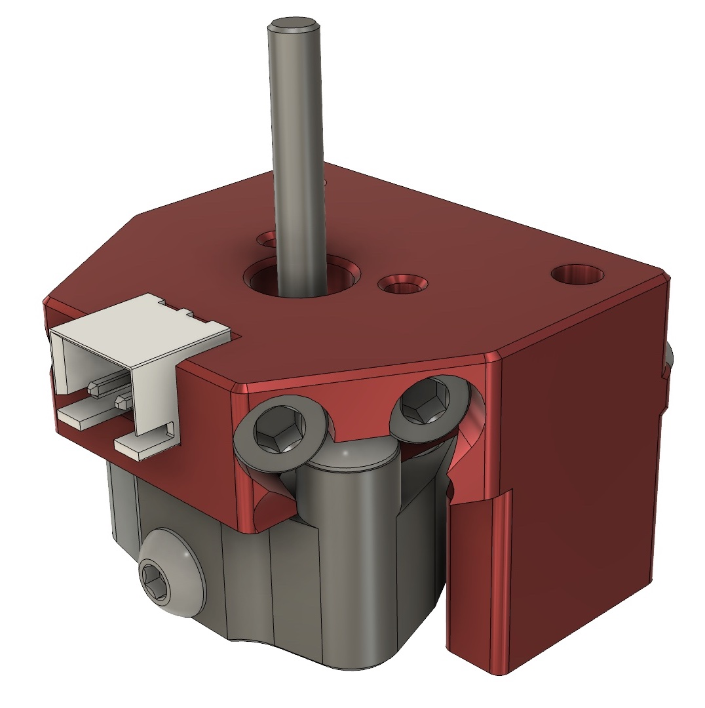 | 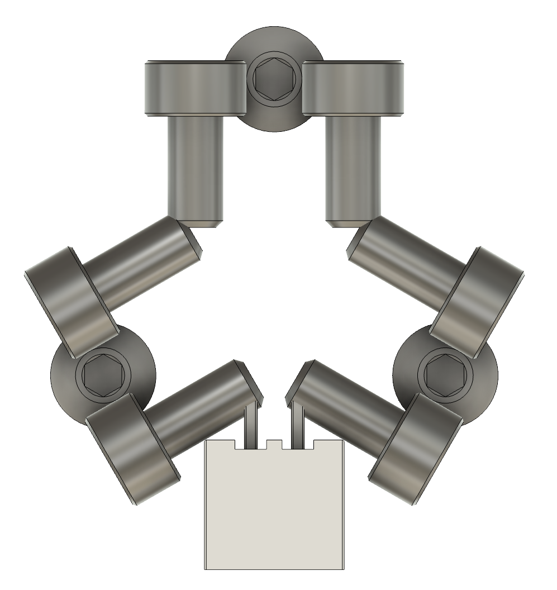 | 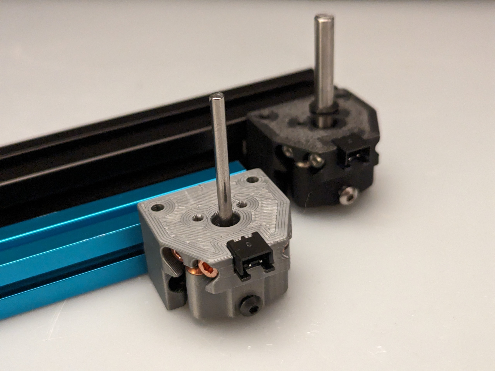 |
| - | - | - |

**Nudge** is a low-cost, high-repeatability probe to enable automatic nozzle alignment on multi-toolhead 3D printers (IDEX, Dual Gantry, and Toolchanger).  

It’s like a Z endstop, but can be nudged in X and Y directions, too.  

When the metal probe tip is nudged by the nozzle, one of the vertical button-head screws in the Wobbler lifts off slightly from the socket-head screws in the Mount, breaking the electrical path.  Software nudges the nozzle against the probe in Z, then X, and Y, repeating this process to determine offsets between any number of toolheads.

When multiple heads can work together, with perfect alignment, multi-color and multi-material prints look great!  

Here's a sample from Ankurv ([3DUnplugged]()), whose [Daksh v2]() toolchanger uses Nudge to ensure alignment betweeen heads:

| 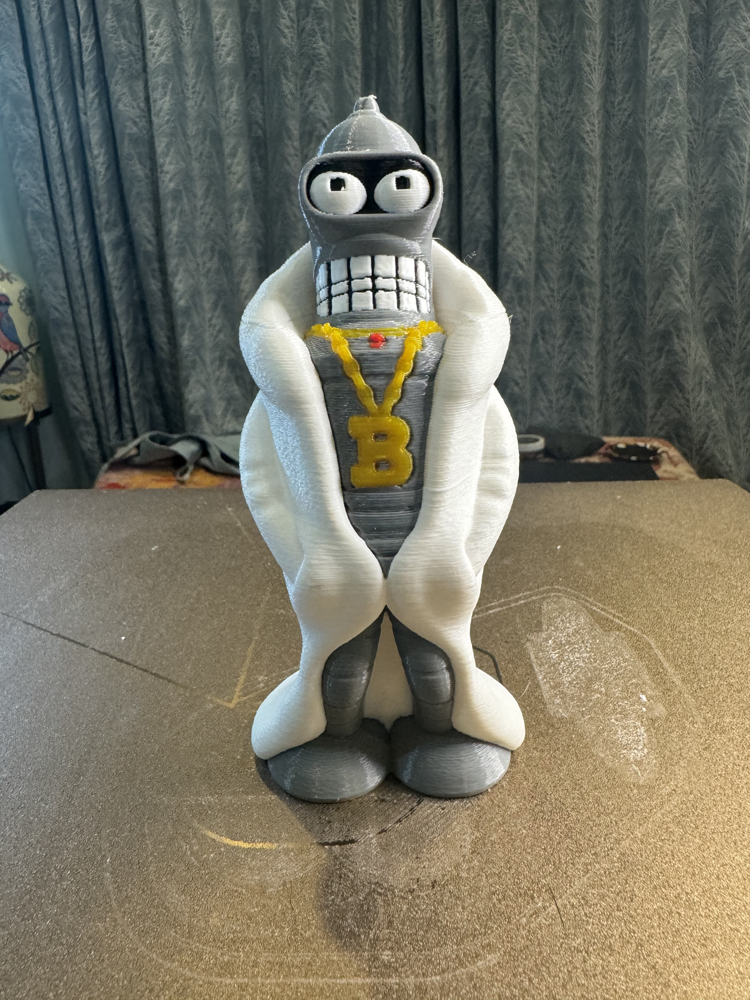 | 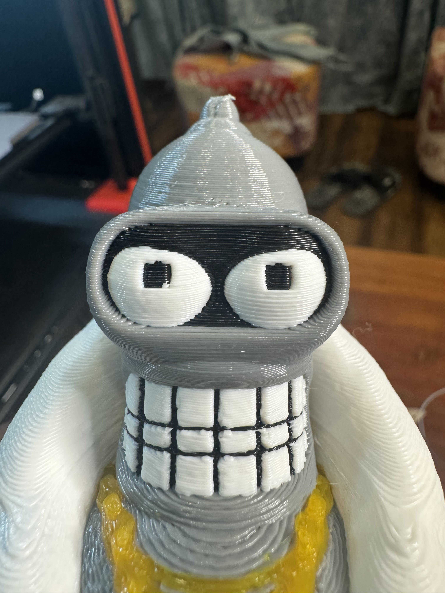 | 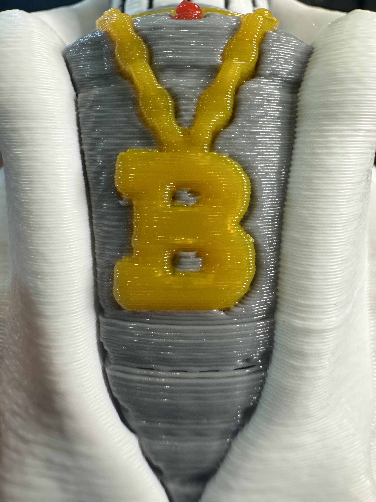 |
| - | - | - |

You can print, build, and deploy a Nudge in as little as one hour, with only $10 in parts, using the instructions in this repo, or with this video (yes, it used to have a 'y' at the end of the name):

[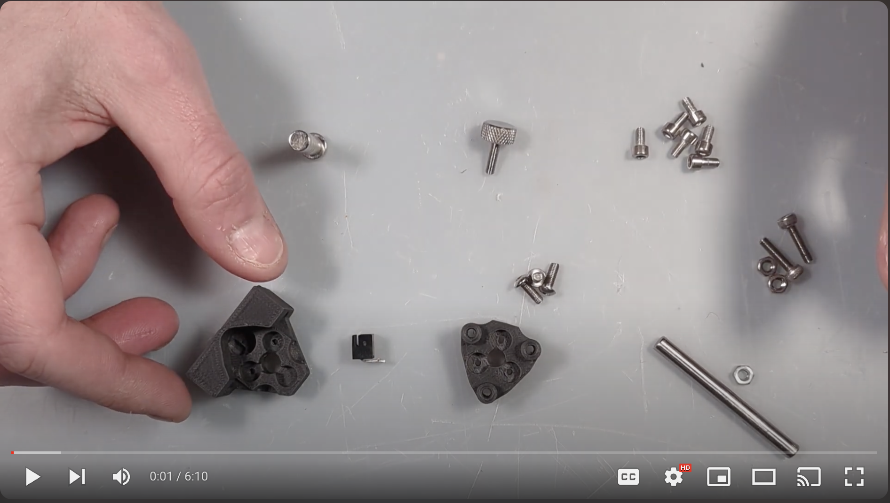](https://youtu.be/6eRomxUo7TI)

## [> > > Watch build](https://youtu.be/6eRomxUo7TI)

Nudge is highly repeatable; here's an early sample of probing accuracy from a 10-sample run:
```
Printing stats for x:
  Range: 0.0023
  Standard Deviation: 0.0010
Printing stats for y:
  Range: 0.0016
  Standard Deviation: 0.0007
--- 95.45 seconds total; 19.09 per iteration ---
```

Definitely usable!

**Firmware Support**: Nudge combines well with [Viesturz' NozzleAlign code](https://github.com/viesturz/NozzleAlign), and other kinematics should be possible with Klipper tweaks:

| Printer Type | Klipper Kinematics type | Test/Support Status |
| - | - | - |
| Toolchanger | CoreXY | :white_check_mark: |
| IDEX | Hybrid CoreXY w/ Dual Carriage | Needs [Frans-Willem's Klipper PR](https://github.com/Klipper3d/klipper/pull/6486) |
| IDEX | CoreXZ Dual Carriage | :x: Fails during probing |
| DG | Dual Gantry CoreXY | :x: Fails during probing |

**Hardware Support**: Mounting options for many common multi-toolhead open-source printers/mods are included here, including Trident, Tridex, Tri-Zero, Double Dragon, Dueling Zero, V2, Micron, F-Zero, and more.  One almost certainly fits!  *Unlike other options, a Nudge can be permanently mounted within a hot chamber, with as little as 6mm overtravel.*

**Parts to print**:

| Mount | Wobbler | Floating Base (optional) | Indexed Base (optional)  |
| - | - | - | - |
| 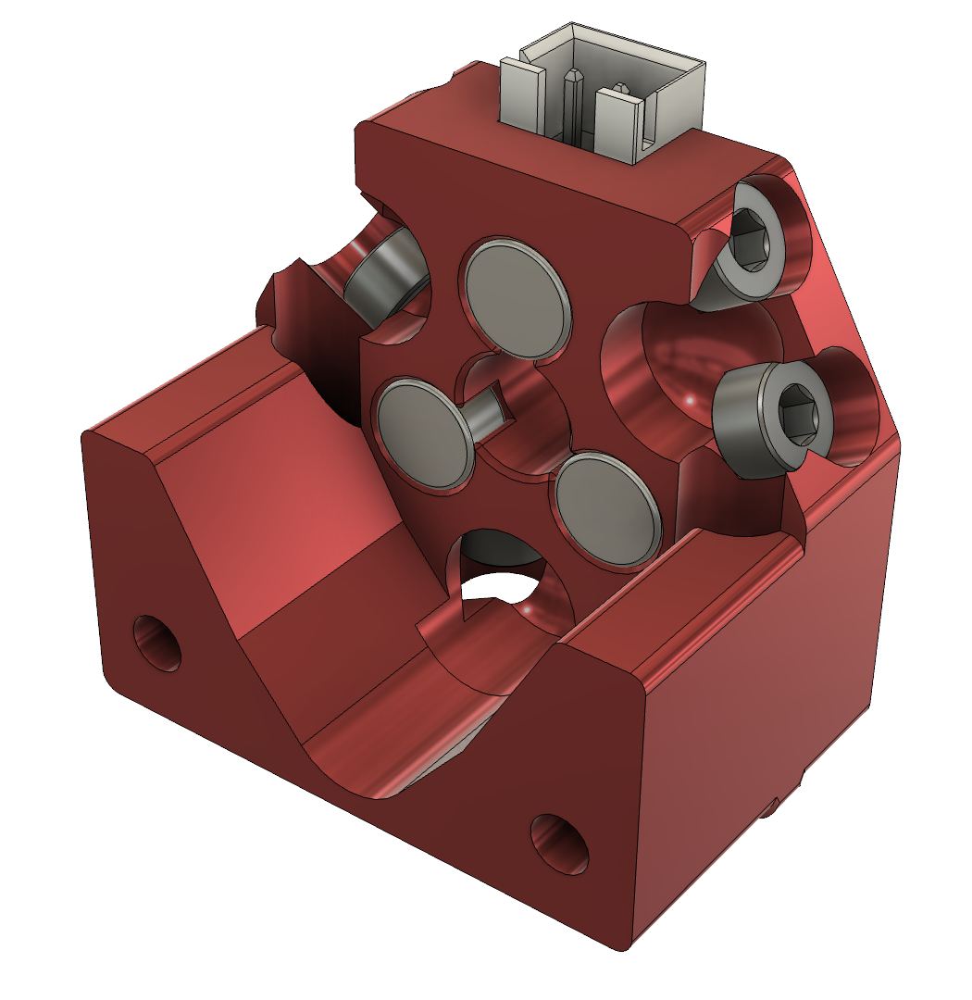 | 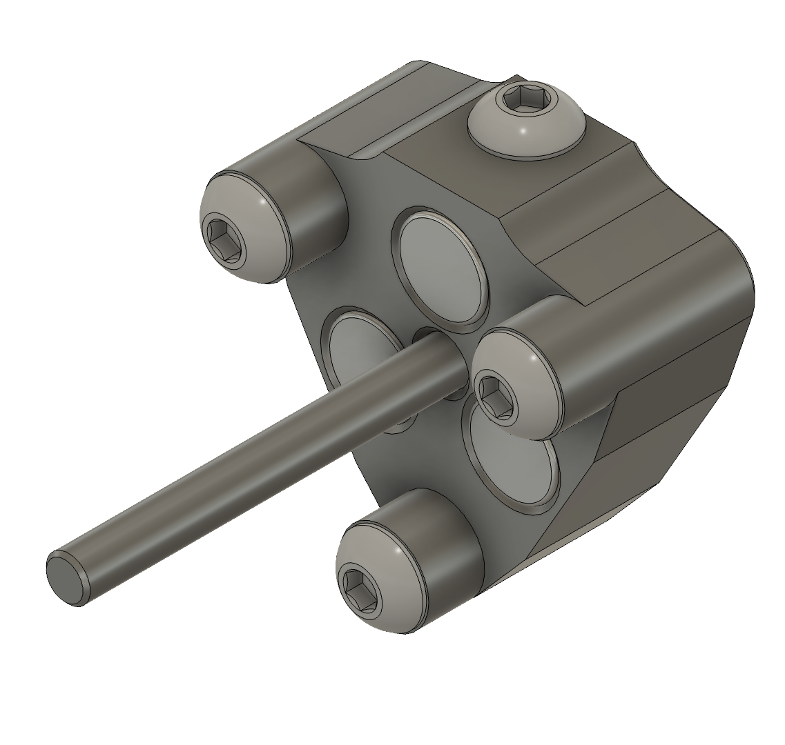 | 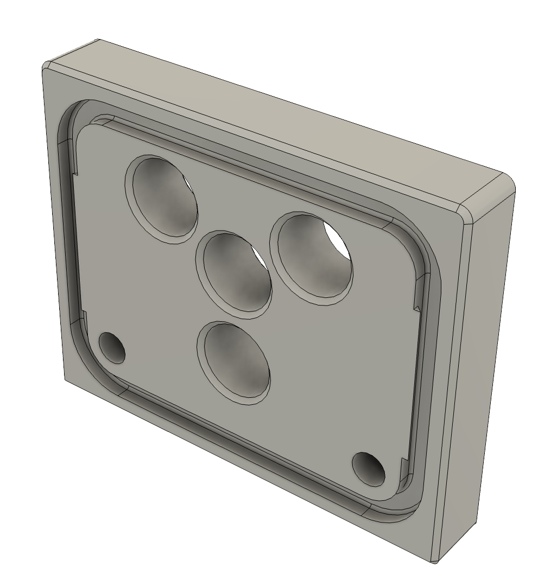 | 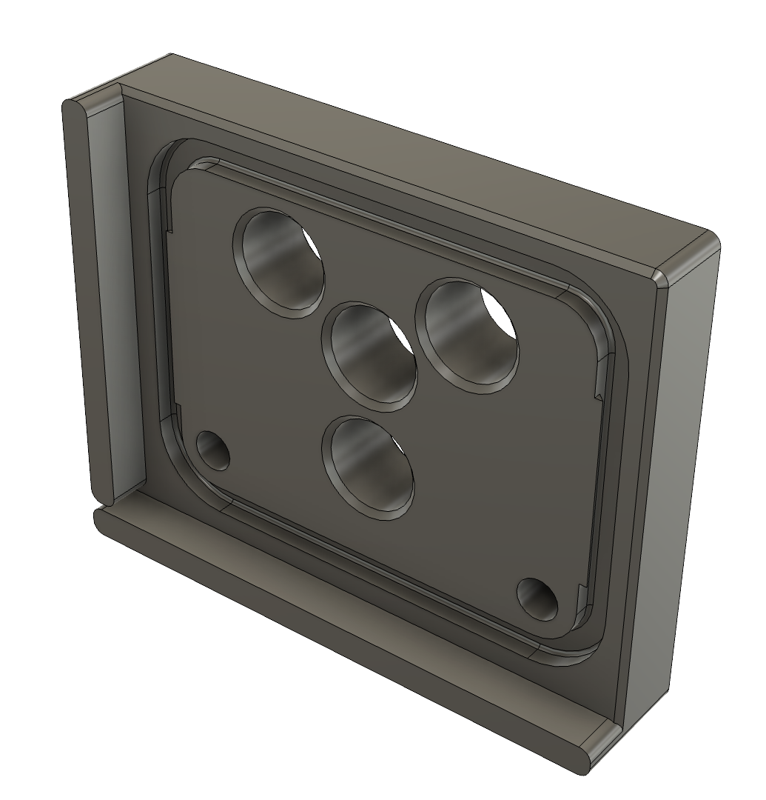 |

**Mount options:**

| 2020 | 1515 High (sticks up) | 1515 Low (sits low) |
| --- | --- | --- |
|  | 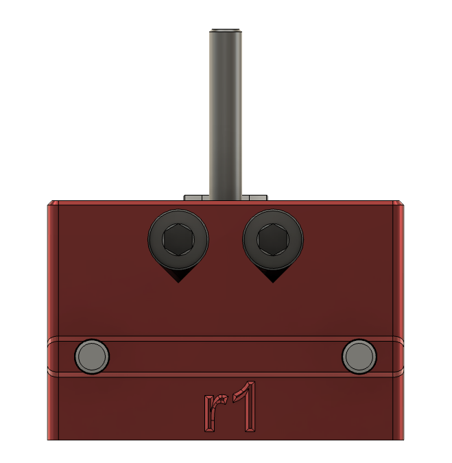  | 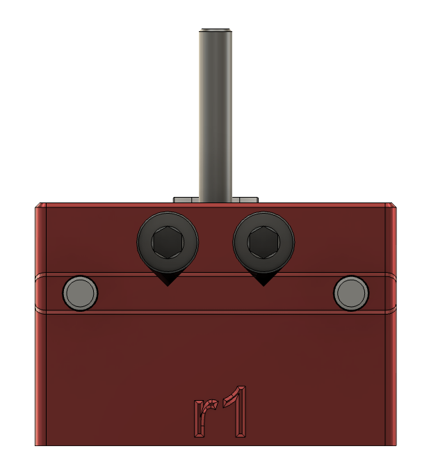 |

**Wobbler options**: 3mm Pin, 5mm Pin, or M3 screw and internally-threaded dowel:
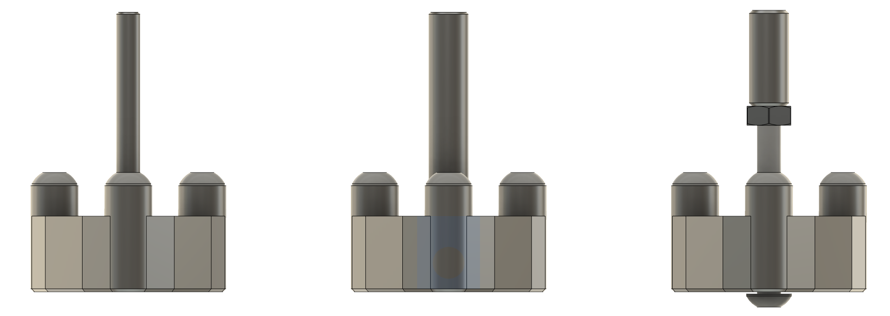

**Sound good?**  Jump to the [Instructions](INSTRUCTIONS.md) section to get started and find the printed parts to match your printer's layout; one should fit!  

Or, read about some advantages to this design...
## Advantages
 * **Highly repeatable** - single-microstep-level repeatability (typically below .003125 Std Dev over 10 samples).
 * **Low cost** - approximately $10.
 * **Easily sourced** - Zruncho had all parts on hand already. All are on Amazon and AliExpress; smooth M3x6 SHCS is the only “new” part.
 * **Minimizes travel loss** - probe tip fits next to the bed; as little as 6mm overtravel suffices.
 * **Easily adjusted** - Z height, position along an extrusion, and magnet forces are all adjustable, in-situ.
 * **Fast build and print** - print, build, and test in about an hour.  No heatsets, soldering, or gluing required.
 * **Flexible mounting** - options are available to fit almost any printer.
 * **Simple wiring** - 2-pin JST header matches existing Z nozzle endstops.
 * **Temperature-tolerant** - no electronics to burn out at chamber temps (like a camera), and no plastic next to the bed to melt.
 * **In-place mounting option** - run this at the start of every print, just like a QGL or ZTA cycle, so that offsets are perfect, even with temperature changes, or after tightening or maintenance.

Like what you see?  [Buy me a coffee](https://ko-fi.com/zruncho3d) to show the love and enable future mods and content - stuff like [F0](https://github.com/zruncho3d/f-zero), [T0](https://github.com/zruncho3d/tri-zero), [B0](https://github.com/zruncho3d/boxzero), [X0](https://github.com/zruncho3d/double-dragon), [D0](https://github.com/zruncho3d/DuelingZero), [DX](https://github.com/zruncho3d/DuelingX), [ZeroPanels](https://github.com/zruncho3d/ZeroPanels), [ZeroClick](https://github.com/zruncho3d/zeroclick), [NoDropNuts](https://github.com/zruncho3d/f-zero/tree/main/STLs/NoDropNuts), [Poke](https://github.com/zruncho3d/poke), [Vampire Bat](https://github.com/zruncho3d/vampire_bat), and more.

 :heart: *-Zruncho*

## What's Here?

- #### [BOM](BOM.md): Parts list to build your own
- #### [Instructions](INSTRUCTIONS.md): Instructions to print, assemble, and configure
- #### [Design](DESIGN.md): Learn about why Nudge is designed like that!
- #### [FAQ](FAQ.md): Common questions, answered

## Support

Find the thread in the User Projects forum channel on the DoomCube Discord and post there.

## Credits

**Enjoy!** I hope you enjoy using this as much as the beta team did bringing this to release!  

Special thanks to `Caza` for critical design feedback and ideas, `Ankurv` for all-up testing,  and the beta team who helped validate the design: `Telxoid`, `Esoterical`, `SteveBuilds`, and others who provided data and feedback.

We made a lot of prototypes to get here.

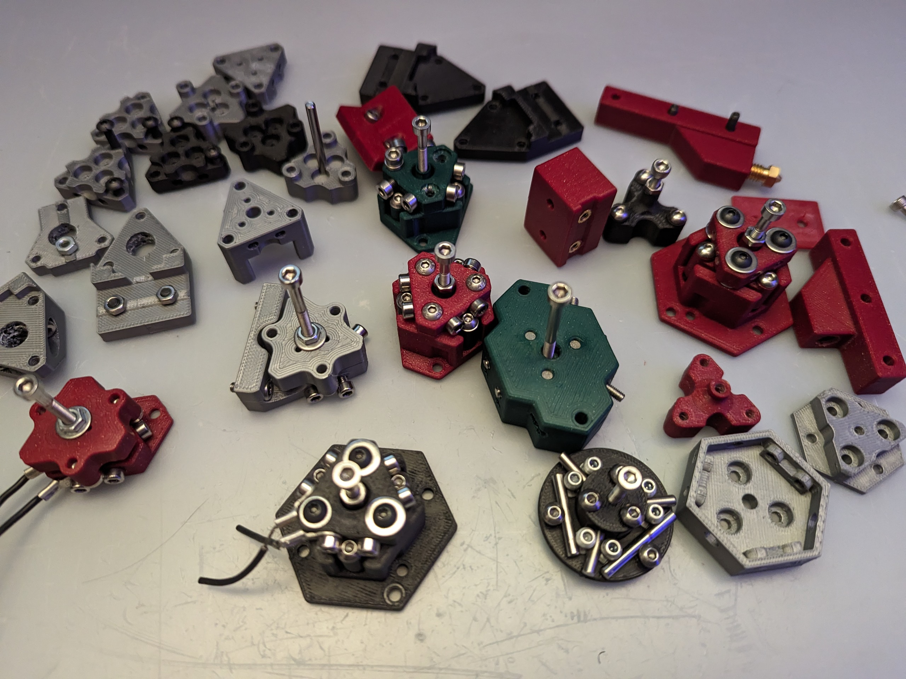

It's 60+ and this isn't even all of then.

Thanks also to [Fabreeko](https://www.fabreeko.com/) for supporting this build!  Without HoneyBadger rails, the test gantry would not have happened, and Nudge would not have been as good.  Support vendors like this, which support open-source dev, whenever you can.

-Z

