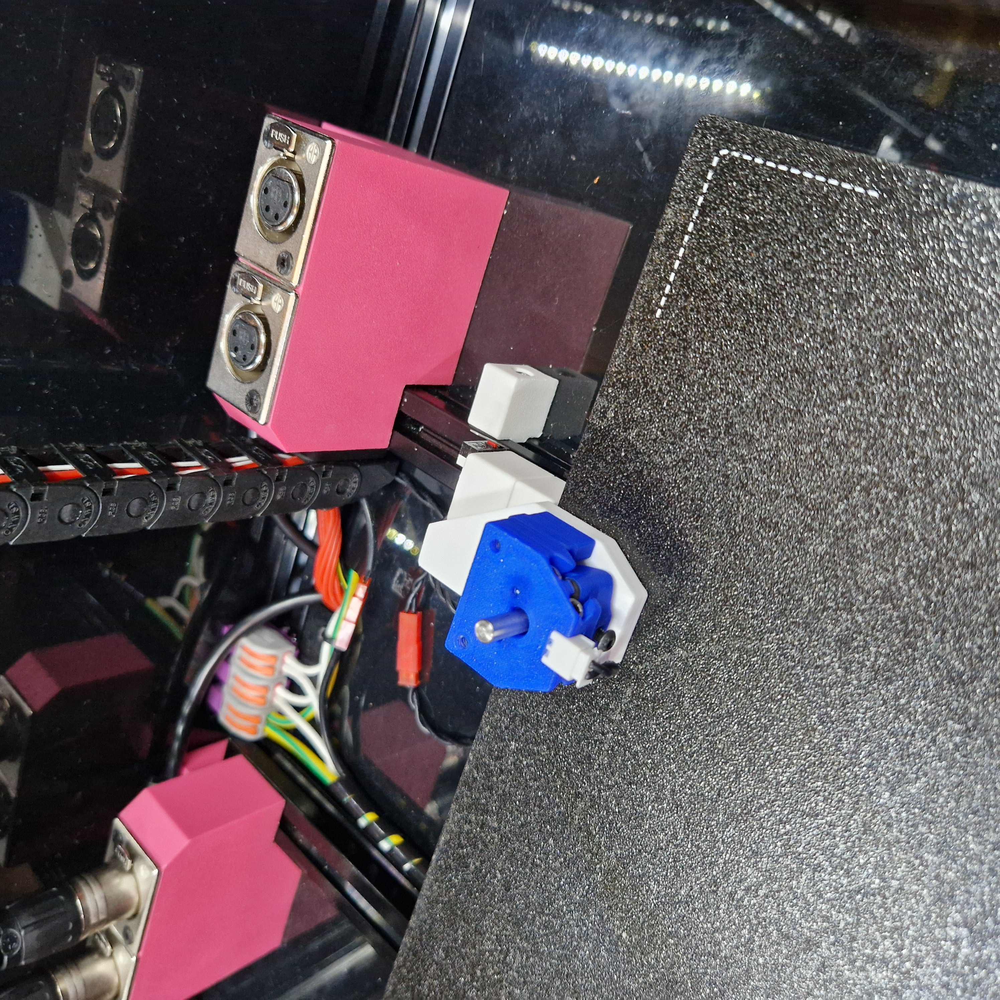
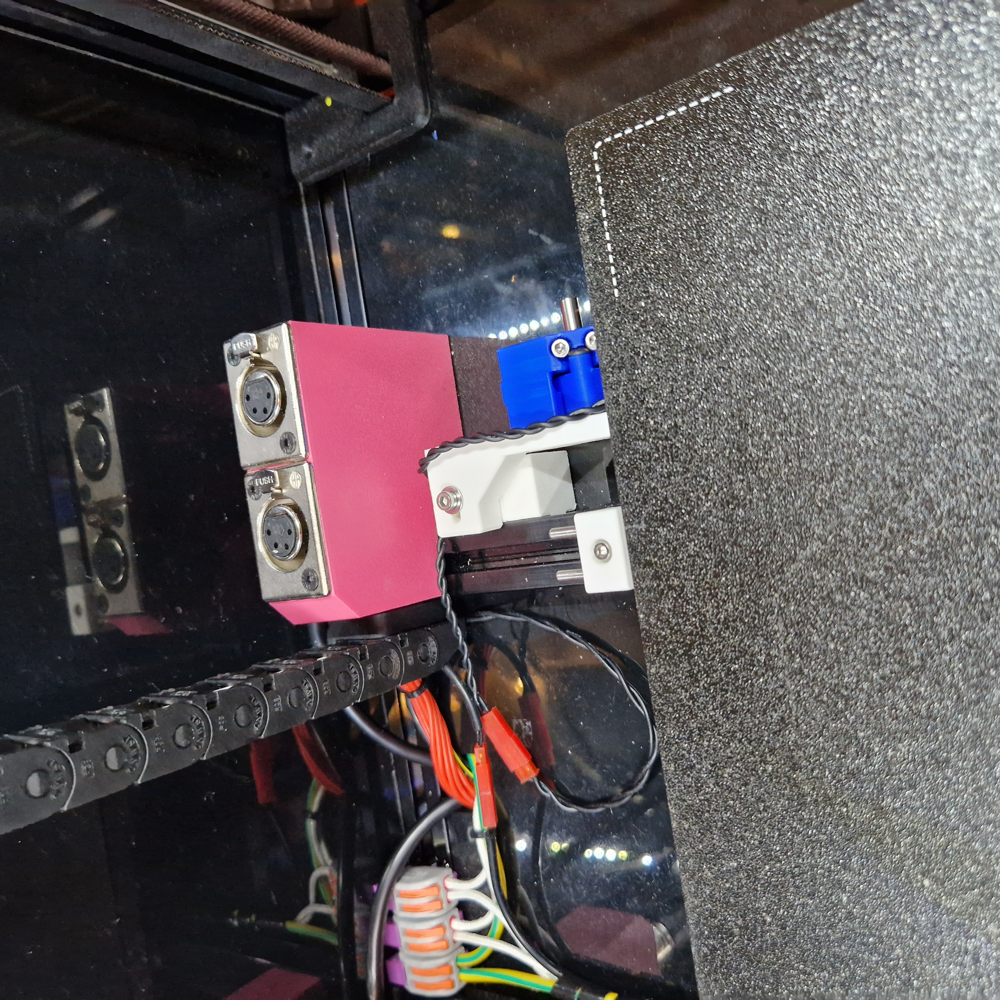
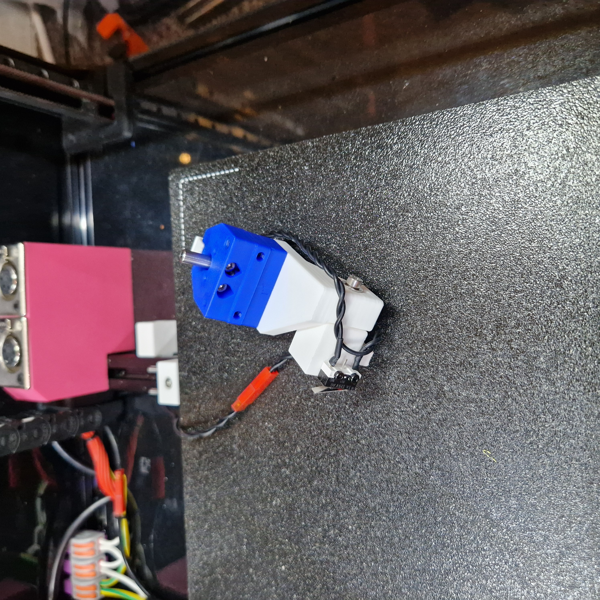
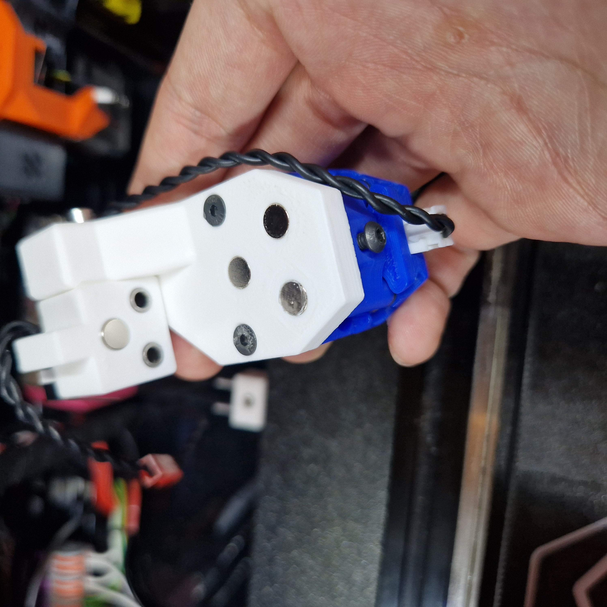

# About

This mod prove a repeatable mounting point for the stock Nudge near the back right corner of the 2.4 bed.

### Feature:

* Avoid reducing built volume in the Y-axis.

* Provide docking point for the Nudge, when not in usage.

* Feature a safety switch, that is triggered and prevent attempts to calibrate if the nudge is still docked.

### BOM:

* 3mm X 20mm pin (2 off)

* 6mm X 3mm, Neodymium Magnet (3 off)

* 3mm Bore x 5mm OD x 5mm Length Plain Bearings (6 off)

* Micro switch (1 off)

* 2mm self-tapping screws (2 off)

* M3 x 20mm (2 off)

* M3 x 18mm (1 off)

* M3 x 5 x 4 threaded insert (1 off)

* M3 washer (1 off)

* M3 x 25mm counter sunk (2 off)

* Super glue - for the magnets (optional)

### Notes:

* As the 3mm pins and sleeves are press-in-place, you might need a parallel clamp that can open at least 32mm wide. Alternatively, you can widen the holes with 3mm and 5mm drill bits.

* BE MINDFUL OF THE MAGNET DIRECTION. The part will need to be destroyed for magnet recovery.

### Pictures:

